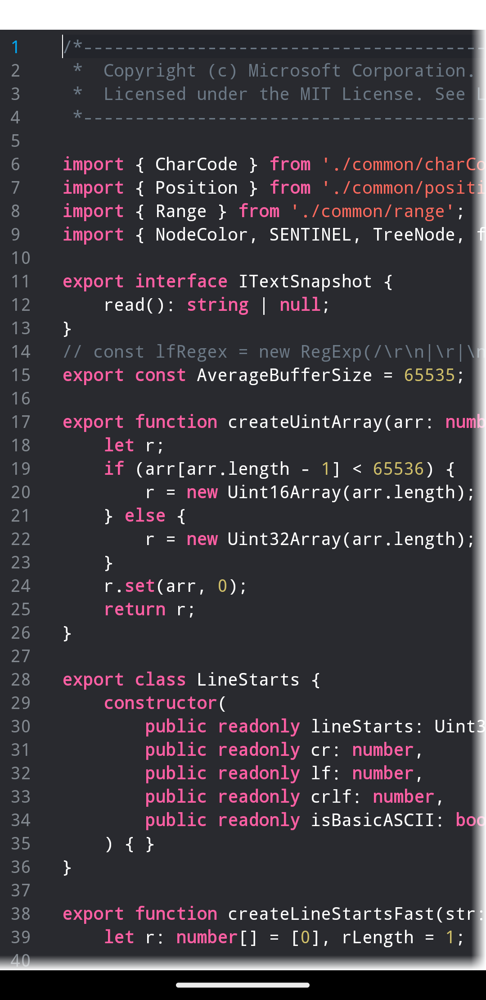
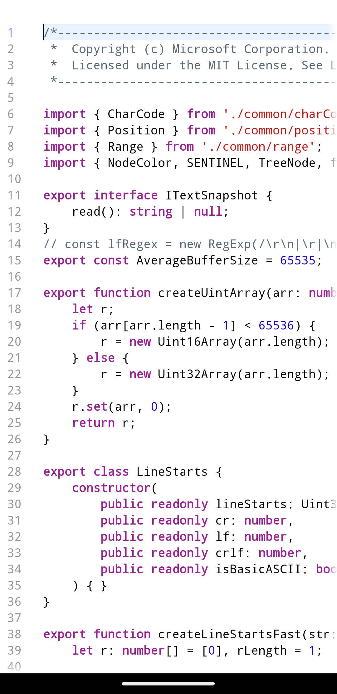

# CodeEditText

Code editor view for android, support to Android 4.0 devices

## Screenshots

This is the default dark theme.



This is the default light theme.



## Features

- [x] Large text editing
- [ ] Scrolling and zoomable
- [x] Customize the color scheme
- [x] Custom tabs and spaces
- [ ] Whitespace display
- [ ] hyperlink display
- [x] Syntax highlighting
- [ ] Syntax error

## How to use it

Typical usage of the view is as follows.

```java
public class MainActivity extends AppCompatActivity {
	
	protected void onCreate(Bundle savedInstanceState) {
		super.onCreate(savedInstanceState);
		EditorView view = new EditorView(this);
		//options...
		view.setFontSize(18);
		view.setCaretVisible(true);
		view.setCaretLineVisible(true);
		view.setCaretBlinks(true);
		view.setTabSize(8);
		view.setColorScheme(new ColorSchemeDark());
		//update configure
		view.configure();
		//set text
		view.setText("Code Editor");
		setContentView(view);
	}
}
```

## License

Copyright (C) 2023 weg2020.

Distributed under the Apache-2.0 license — see the [license file](LICENSE) for details.